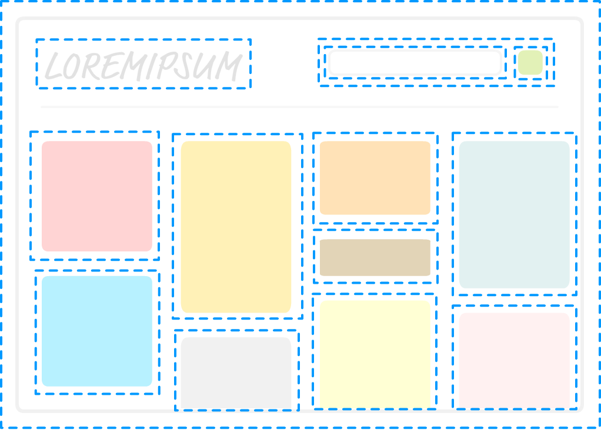
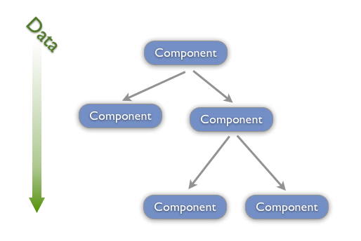
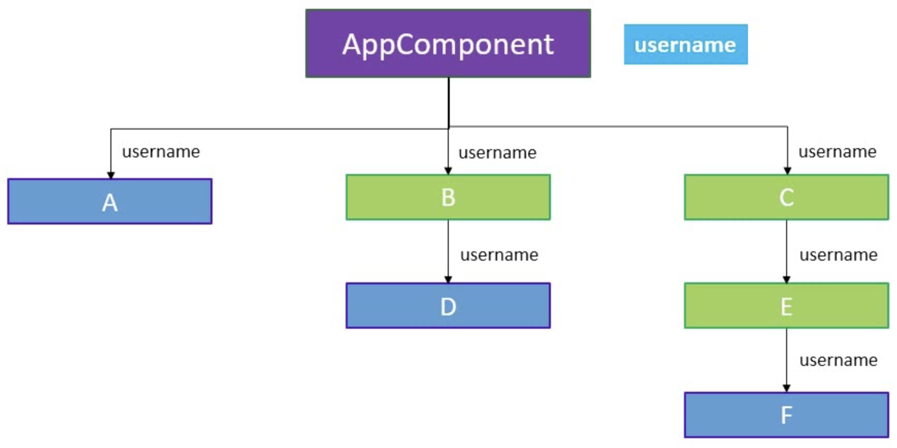
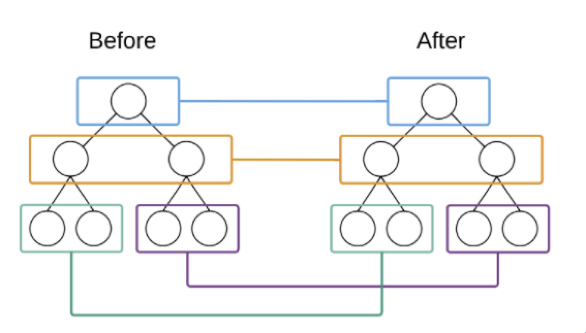

# Mini React
这的repo包含两部分：
- React基础知识点
- Mini React的实现
# React 知识点
## 什么是React
React 是一个用于构建用户界面的 JavaScript 库，它只负责应用的视图层，帮助开发人员构建快速且交互式的 web 应用程序。

React 使用组件的方式构建用户界面。

## JSX 语法
在 React 中使用 JSX 语法描述用户界面，它是一种 JavaScript 语法扩展。JSX 语法就是一种语法糖，让开发人员使用更加舒服的代码构建用户界面。

在 React 代码执行之前，Babel 会对将 JSX 编译为 React API.

```tsx
<div className="container">
  <h3>Hello React</h3>
  <p>React is great </p>
</div>
```

```tsx
React.createElement(
  "div",
  {
    className: "container"
  },
  React.createElement("h3", null, "Hello React"),
  React.createElement("p", null, "React is great")
);
```

## 什么是组件
React 是基于组件的方式进行用户界面开发的. 组件可以理解为对页面中某一块区域的封装。

- 组件名称首字母必须大写，用以区分组件和普通标签。
- jsx语法外层必须有一个根元素



## 单向数据流

1.  在React中, 关于数据流动有一条原则, 就是单向数据流动, 自顶向下, 从父组件到子组件.

2.  单向数据流特性要求我们共享数据要放置在上层组件中.

3.  子组件通过调用父组件传递过来的方法更改数据.

4.  当数据发生更改时, React会重新渲染组件树.

5.  单向数据流使组件之间的数据流动变得可预测. 使得定位程序错误变得简单.

   


## 组件状态
state 状态对象中的数据不可直接更改，如果直接更改 DOM 不会被更新，要更改 state 状态数据需要使用 setState方法。因为我们的component extends的React.Component里面就定义了，setState()以后，还会调用diff()来更新DOM

## 类组件生命周期函数


## Context 
通过 Context 可以跨层级传递数据



## 路由
url地址与组件之间的对应关系，访问不同的url地址显示不同的组件。

### 路由基本使用

```tsx
// App.js
import React from 'react';
import { BrowserRouter as Router, Route, Link } from 'react-router-dom';
function Index() { return <div>首页</div>; }
function News() { return <div>新闻</div>; }
function App() {
  return (
    <Router>
      <div>
        <Link to="/index">首页</Link>
        <Link to="/news">新闻</Link>
      </div>
      <div>
        <Route path="/index" component={Index}/>
        <Route path="/news" component={News}/>
      </div>
    </Router>
  );
}
```

### 路由嵌套

```tsx
function CompanyNews() { return <div>公司新闻</div> }
function IndustryNews() { return <div>行业新闻</div> }

function News(props) {
  return (
    <div>
      <div>
        <Link to={`${props.match.url}/company`}>公司新闻</Link>
        <Link to={`${props.match.url}/industry`}>行业新闻</Link>
      </div>
      <div>
        <Route path={`${props.match.path}/company`} component={CompanyNews} />
        <Route path={`${props.match.path}/industry`} component={IndustryNews}/>  
      </div>	
    </div>
  );
}
```

### 路由传参
```tsx
// 路由跳转:把需要的参数当成query传进来
<Link to={`/detail?id=${item.id}`}>{ item.title }</Link>

// 用
const { query } = url.parse(this.props.location.search, true);
```

## Virtual DOM
直接操作DOM比其他大多数 JavaScript 操作要慢的多。大多数 JavaScript 框架对于 DOM 的更新远远超过其必须进行的更新，从而使得这种缓慢操作变得更糟。

例如假设你有包含十个项目的列表，你仅仅更改了列表中的第一项，大多数 JavaScript 框架会重建整个列表，这比必要的工作要多十倍。

为了解决这个问题，React 普及了一种叫做 Virtual DOM 的东西，Virtual DOM 出现的目的就是为了提高 JavaScript 操作 DOM 对象的效率。

**什么是 Virtual DOM:**
在 React 中，每个 DOM 对象都有一个对应的 Virtual DOM 对象，它是 DOM 对象的 JavaScript 对象表现形式，其实就是使用 JavaScript 对象来描述 DOM 对象信息，比如 DOM 对象的类型是什么(type)，它身上有哪些属性(props)，它拥有哪些子元素(children)。

可以把 Virtual DOM 对象理解为 DOM 对象的副本，但是它不能直接显示在屏幕上。

**Virtual DOM 如何提升效率:**
精准找出发生变化的 DOM 对象，只更新发生变化的部分。

在 React 第一次创建 DOM 对象后，会为每个 DOM 对象创建其对应的 Virtual DOM 对象，在 DOM 对象发生更新之前，React 会先更新所有的 Virtual DOM 对象，然后 React 会将更新后的 Virtual DOM 和 更新前的 Virtual DOM 进行比较，从而找出发生变化的部分，React 会将发生变化的部分更新到真实的 DOM 对象中，React 仅更新必要更新的部分。

Virtual DOM 对象的更新和比较仅发生在内存中，不会在视图中渲染任何内容，所以这一部分的性能损耗成本是微不足道的。


# Mini React 实现
## 打包
在 React 代码执行前，JSX 会被 Babel 转换为 `React.createElement` 方法的调用，在调用 createElement 方法时会传入元素的类型，元素的属性，以及元素的子元素，createElement 方法的返回值为构建好的 Virtual DOM 对象。

而我们的例子需要用`TinyReact.createElement()`，所以首先要用到webpack的@babel/preset-react将代码compile成es5，这样就会把JSX的模板装换成`TinyReact.createElement()`
```json
{
  "presets": [
    "@babel/preset-env",
    [
      "@babel/preset-react",
      {
        // instead of compiling to `React.createElement`
        "pragma": "TinyReact.createElement"
      }
    ]
  ]
}
```

## 导出的函数
导出三个函数
- createElement: 用来创建virtual DOM
- render：diff并且渲染真实DOM
- Component：类组件的定义

```ts
// index.js
import createElement from './createElement';
import render from './render';
import Component from './Component';

export default {
  createElement,
  render,
  Component,
};
```

### createElement
```ts
export default function createElement(type, props, ...children) {
  const childElements = [].concat(...children).reduce((result, child) => {
    if (child !== false && child !== true && child !== null) {    // 这几个值不需要被渲染到界面上
      if (child instanceof Object) {
        result.push(child);
      } else {
        result.push(createElement('text', { textContent: child }));
      }
    }
    return result;
  }, []);

  return {
    type,
    props: Object.assign({ children: childElements }, props),   // 需要单独加入children属性
    children: childElements,
  };
}
```

**注意：** 组件的 Virtual DOM 类型值为函数，函数组件和类组件都是这样的。

```tsx
const Heart = () => <span>&hearts;</span>
// 或者
<Heart />

// 他们的的 Virtual DOM：
{
  type: f function() {},
  props: {}
  children: []
}
```

### Component
类组件需要继承 Component 父类，子类需要通过 super 方法将自身的 props 属性传递给 Component 父类，父类会将 props 属性挂载为父类属性，子类继承了父类，自己本身也就自然拥有props属性了。这样做的好处是当 props 发生更新后，父类可以根据更新后的 props 帮助子类更新视图。
```ts
export default class Component {
  constructor(props) {
    // 所以子类必须要super(props),不然拿不到props
    this.props = props;
  }

  setState(state) {
    // 就是这里在setState以后会获取新的vdom，再调用diff更新视图
    this.state = Object.assign({}, this.state, state);

    let newVDOM = this.render();     // 最新的要渲染的 newVDOM 对象
    let oldDOM = this.getDOM();      // 旧的 virtualDOM 对象 进行比对
    let container = oldDOM.parentNode;

    diff(newVDOM, container, oldDOM);
  }

  setDOM(dom) {
    this._dom = dom;
  }

  getDOM() {
    return this._dom;
  }

  updateProps(props) {
    this.props = props;
  }

  // 生命周期函数
  componentWillMount() {}
  componentDidMount() {}
  componentWillReceiveProps(nextProps) {}
  shouldComponentUpdate(nextProps, nextState) {
    return nextProps != this.props || nextState != this.state;
  }
  componentWillUpdate(nextProps, nextState) {}
  componentDidUpdate(prevProps, preState) {}
  componentWillUnmount() {}
}
```

### render
render其实就是直接调用了diff
```ts
export default function render(
  virtualDOM,
  container,
  oldDOM = container.firstChild
) {
  diff(virtualDOM, container, oldDOM);
}
```

## Diff
render的核心是diff，分为四种情况
```ts
if (!oldDOM) {   
  // 1) 如果没有oldDOM: 直接mount                                                       
  mountElement(virtualDOM, container);
} else if (                                                             
  virtualDOM.type !== oldVirtualDOM.type &&
  typeof virtualDOM.type !== 'function'
) {
  // 2) 如果节点类型不同，并且新节点的类型不是组件: 
  // 不需要对比，直接使用新的 virtualDOM 对象生成真实 DOM 对象，替换旧的 DOM 对象
  const newElement = createDOMElement(virtualDOM);
  oldDOM.parentNode.replaceChild(newElement, oldDOM);
} else if (typeof virtualDOM.type === 'function') {      
  // 3) 新节点的类型是组件, 就diff组件,这里的逻辑很简单：
  // - 是同一个组件：做组件更新操作 
  // - 不是同一个组件：直接挂载新组件替换旧组件
  diffComponent(virtualDOM, oldComponent, oldDOM, container);
} else if (oldVirtualDOM && virtualDOM.type === oldVirtualDOM.type) {   
  // 4) 新旧节点是同类型，这里要（对children）做真正的DOM diff

  // 首先更新node本身的属性
  if (virtualDOM.type === 'text') {
    updateTextNode(virtualDOM, oldVirtualDOM, oldDOM);     // 更新text内容
  } else {
    updateNodeElement(oldDOM, virtualDOM, oldVirtualDOM);  // 更新元素节点属性
  }

  // 接下来DOM Diff children
  // ......

```

### DOM diff
DOM diff是深度优先对比，优先对比子节点，再同级节点



在进行 Virtual DOM 比对时，需要用到更新后的vdom和更新前的 Virtual DOM
- 新vdom可以通过 render 方法进行传递
- 老vdom可以在创建真实DOM对象时，将vdom存进真实 DOM 对象的属性中。

 ```tsx
// mountElement.js
import mountElement from "./mountElement"

export default function mountNativeElement(virtualDOM, container) {
  // 将 Virtual DOM 挂载到真实 DOM 对象的属性中 方便在diff时获取其 Virtual DOM
  newElement._virtualDOM = virtualDOM
}
```

### Key的作用
渲染列表数据时通常会在被渲染的列表元素上添加 key 属性，key 属性就是数据的唯一标识，帮助 React 识别哪些数据被修改或者删除了，从而达到 DOM 最小化操作的目的。

key 属性不需要全局唯一，但是在同一个父节点下的兄弟节点之间必须是唯一的。

#### 没有key的情况
```ts
// 对比：直接按index对比，效率低
virtualDOM.children.forEach((child, i) => {
  diff(child, oldDOM, oldDOM.childNodes[i]);
});

// 删除：直接把后面多的删掉，因为只有前面的index有用
for (
  let i = oldNodes.length - 1;
  i > newNodes.length - 1;
  i--
) {
  unmountNode(oldNodes[i]);
}
```

#### 有key的情况
```ts
// 对比: 用一个对象存储所有的oldDOM子元素的{ key：node }, 然后循环新的vdom的子元素，在循环过程中获取到这个子元素的 key 属性，然后使用这个 key 属性到 JavaScript 对象中查找 DOM 对象，如果能够找到就说明这个元素是已经存在的，是不需要重新渲染的。如果通过key属性找不到这个元素，就说明这个元素是新增的是需要渲染的。
let keyedElements = {};
for (let i = 0, len = oldDOM.childNodes.length; i < len; i++) {
  let domElement = oldDOM.childNodes[i];
  if (domElement.nodeType === 1) {
    let key = domElement.getAttribute('key');
    if (key) {
      keyedElements[key] = domElement;
    }
  }
}

virtualDOM.children.forEach((child, i) => {
  const key = child.props.key;
  const oldNode = oldDOM.childNodes[i];
  if (key) {
    let foundOldNode = keyedElements[key];     // 对应的老元素element
    if (foundOldNode) {
      // 看看当前位置的元素是不是同一个node
      // 如果是的话，什么都不用做，如果不是的话，插入到当前节点
      if (oldNode && oldNode !== foundOldNode) {
        oldDOM.insertBefore(foundOldNode, oldNode);
      }
    } else {                    // 找不到对应的老元素element，说明当然元素是新增的，直接插入
      mountElement(child, oldDOM, oldNode, false);
    }
  }
});

// 删除
for (let i = 0; i < oldNodes.length; i++) {
  let oldChild = oldNodes[i];
  let oldChildKey = oldChild._virtualDOM.props.key;
  let found = false;

  // 新节点里面没有这个key，就说明被删除了
  for (let n = 0; n < newNodes.length; n++) {
    if (oldChildKey === newNodes[n].props.key) {
      found = true;
      break;
    }
  }
  
  !found && unmountNode(oldChild);
}
```

#### 删除节点的触发条件：
删除节点发生在节点更新以后并且发生在同一个父节点下的所有子节点身上。在节点更新完成以后，如果旧节点对象的数量多于新 VirtualDOM 节点的数量，就说明有节点需要被删除。
```ts
// 删除节点
if (oldNodes.length > newNodes.length) {
  if (hasNoKey) {   // 如果没有key：一个个删除后面的节点
  } else {          // 如果有key：通过key找到oldNodes里面被删除的节点
  }
}
```

#### key的例子
a b c d   （旧vdom）
a x b c d （新vdom）

没有key的话会做四件事：
- b => x
- c => b
- d => c
- insert d

有key的话只会做一件事：
- insert x